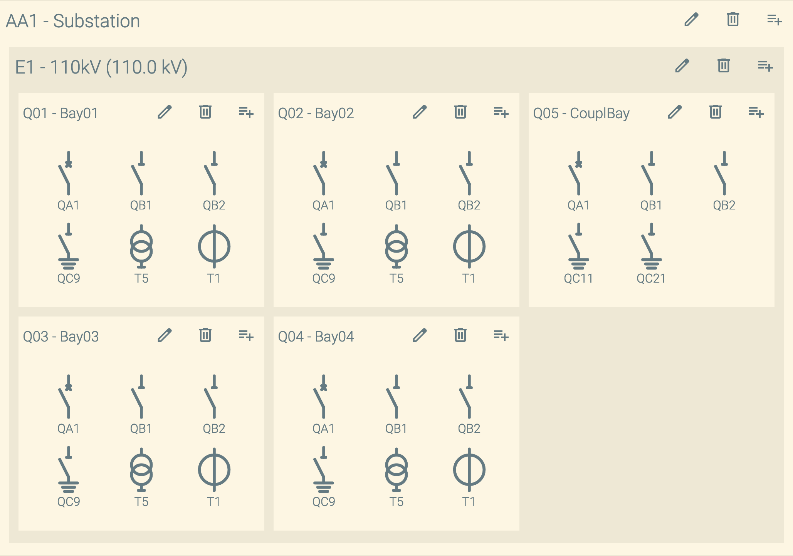

[](https://github.com/OMICRONEnergyOSS/oscd-editor-substation/actions/workflows/test.yml) 

# \<oscd-editor-substation>



## What is this?

This is an editor plugin for [OpenSCD](https://openscd.org).

This plugins allows you to edit, remove and add all elements within the `Substation` section including the elements `Line` and `Process` which can be technically parents/siblings of Substation.

## What is on the roadmap

- Add copy feature for `VoltageLevel` and `Bay` elements.
- Something missing: file an [issue](https://github.com/OMICRONEnergyOSS/oscd-editor-substation/issues) and we do our best to add it.

## Online access on [Demo](https://omicronenergyoss.github.io/oscd-editor-substation/demo/index.html)

## Linting and formatting

To scan the project for linting and formatting errors, run

```bash
npm run lint
```

To automatically fix linting and formatting errors, run

```bash
npm run format
```

## Testing with Web Test Runner

> This demo plugin does nothing much that could be tested as it relies exclusively on built-in browser components to do its job. We therefore currently have no tests. If you find something that could be tested, please feel free!

To execute a single test run:

```bash
npm run test
```

To run the tests in interactive watch mode run:

```bash
npm run test:watch
```

## Tooling configs

For most of the tools, the configuration is in the `package.json` to reduce the amount of files in your project.

If you customize the configuration a lot, you can consider moving them to individual files.

## Local Demo with `web-dev-server`

```bash
npm run start
```

To run a local development server that serves the basic demo located in `demo/index.html`

## License

[Apache-2.0](LICENSE)

&copy; Jakob Vogelsang

&copy; 2025 OMICRON electronics GmbH
